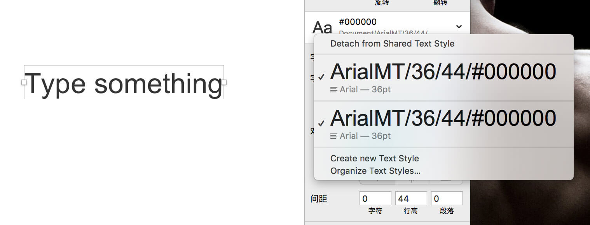
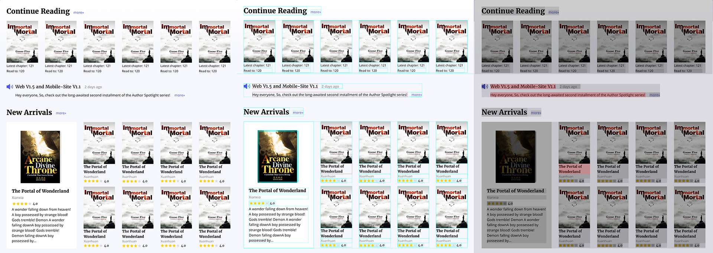

<h1 align="center">y-tools - Sketch plugins from yued-fe.TM</h1>

## Features

1. Scope icon | 图标结界
2. Create shared text style with rules | 创建共享文本样式
3. Topographic | 显示设计稿地貌和线框

### Scope icon | 图标结界

`ctrl alt cmd i`

Wrap the Icon with a square(4n).

以图标中心点为中心，创建一个最接近的以4为倍数的透明正方形，然后用一个Group包裹图标和背景。

### Create shared text style with rules | 创建共享文本样式

`ctrl alt cmd s`

Create Shared text with name `${fontFamily}/${fontSize}/${lineHeight}/${color}/${fontWeight}`

### Topographic | 显示设计稿地貌和线框

`ctrl alt cmd t`

show the frame with a 'rgba(0,0,0,0.1)' shape

`ctrl alt cmd b`

show the frame with a 'rgba(0,255,255,0.8)' border

`ctrl alt cmd z`

clear all

* In our team, we highly recommend that each text should be a shared text style. If there is a text without shared text style the gray shape or the blue line will turn out to be red. 
* When the text layer `Height%lightHeight!=0` it is error too. 

Of course you can Ingore all the rule when your layer name with `_` start.

